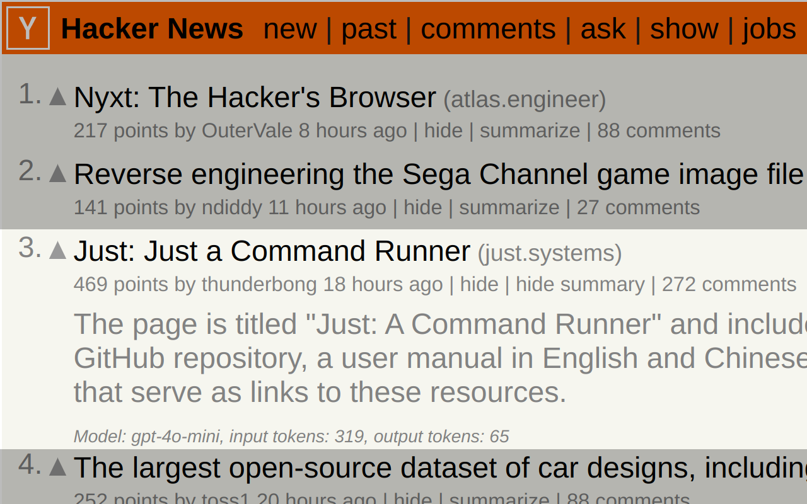

# Hacker News TL;DR

A bring-your-own-key browser extension for summarizing Hacker News articles with OpenAI and Anthropic LLMs.

The extension will add the summarize buttons to the HN front page and article pages. Just provide your Anthropic or OpenAI API key and you're good to go.

🔒️ Security note: The API keys are stored in your browser's storage and synced across devices if the browser is configured to do so.
They are sent by the extension to the LLM providers only.




## Development

To start development:
```
make dev-prepare
```

Dev build:
```
make dev-build
```

Load into Firefox:
```
make dev-run
```

Production build:
```
make build
```

## License

This project is licensed under the GPL-3.0 license. See the [LICENSE](LICENSE) file for details.
