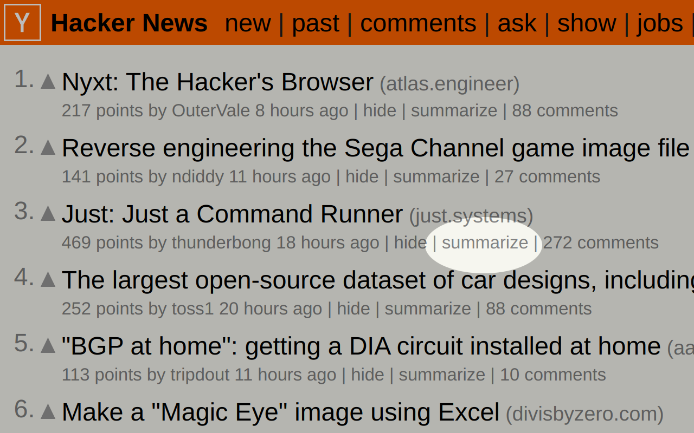

# Hacker News TL;DR

A bring-your-own-key browser extension for summarizing Hacker News articles with LLMs.

The extension will add the summarize buttons to the HN front page and article pages. Just provide your Anthropic (or soon OpenAI) API key and you're good to go.




## Development

To start development:
```
make dev-prepare
```

Dev build:
```
make dev-build
```

Load into Firefox:
```
make dev-run
```

Production build:
```
make build
```

## License

This project is licensed under the GPL-3.0 license. See the [LICENSE](LICENSE) file for details.
